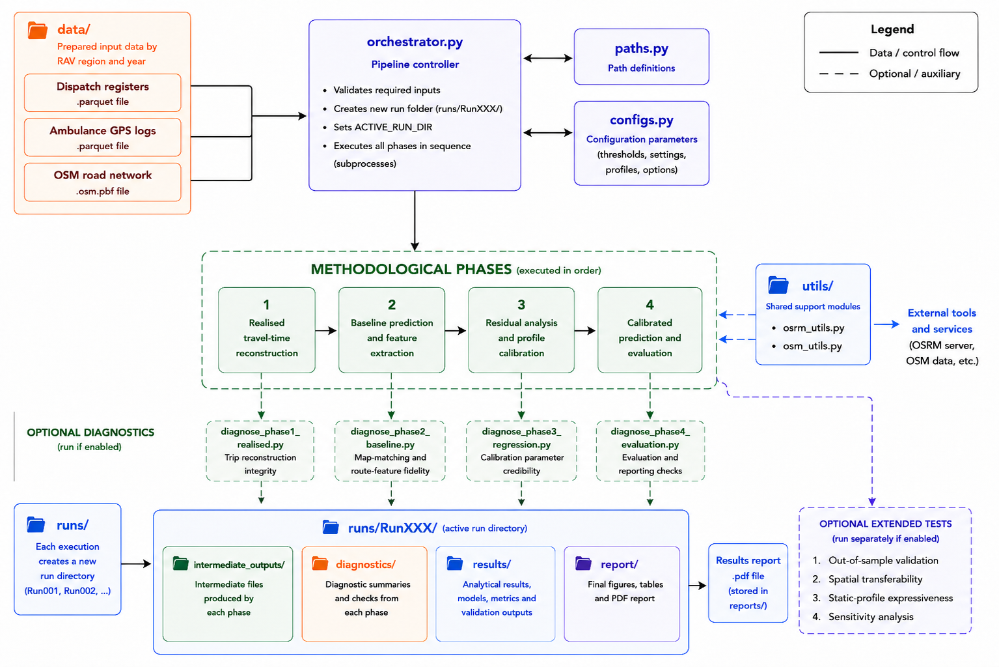

# Ambulance routing-engine calibration pipeline

Empirical calibration framework for OSRM using ambulance GPS trajectory data.
Developed as part of a capstone project at Amsterdam University College (2026).

## What this repository contains

This repository contains the public version of the calibration pipeline,
which runs on synthetic data. Real ambulance dispatch and GPS data are not
included and cannot be shared due to data access agreements.



The pipeline reconstructs ambulance trips from GPS trajectories, map-matches
them to the road network using OSRM, estimates a residual regression model,
and translates the results into adjusted OSRM Lua profile parameters.

## Requirements

- Git and Git LFS
- [uv](https://astral.sh/uv) (Python environment manager)
- [Docker Desktop](https://www.docker.com/products/docker-desktop) (must be running)

## Quickstart

```bash
git clone https://github.com/MafaldaCandal/ambulancePipeline_public
cd ambulancePipeline_public
git lfs install
git lfs pull
uv sync
uv run python orchestrator.py
```

Output is written to `runs/RunXXX/`.

## Optional flags

```bash
uv run python orchestrator.py --diagnostics
uv run python orchestrator.py --extended-tests
uv run python orchestrator.py --diagnostics --extended-tests
```

## Repository structure

| Folder / file | Contents |
|---|---|
| `data/input_synthetic/` | Synthetic dispatch and GPS inputs |
| `diagnostics/` | Phase-level diagnostic scripts |
| `docker/` | Pinned Docker image references |
| `extended_tests/` | Robustness and transferability tests |
| `methodology/` | Supporting methodological scripts |
| `profiles/` | OSRM Lua profiles including base and ambulance profile |
| `utils/` | Shared utility functions |
| `orchestrator.py` | Main entry point |
| `configs.py` | All configurable parameters |
| `paths.py` | Centralised file path definitions |

## Reproducibility

Docker image versions are pinned in `docker/osrm_image.txt` and
`docker/gdal_image.txt`. A fixed random seed is used throughout synthetic
data generation. Running `uv run python orchestrator.py` on the synthetic
data produces identical outputs across runs.